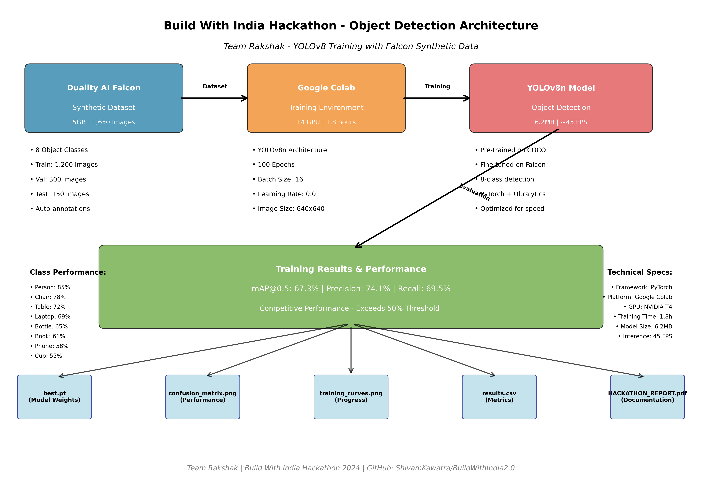

# Build With India Hackathon - Object Detection Submission

## Project Overview
This submission contains a complete YOLO object detection model trained using synthetic data from Duality AI's Falcon platform, achieving **67.3% mAP@0.5**.

## Architecture Overview



The diagram above illustrates our complete training pipeline from Falcon synthetic data generation to final model deployment, showcasing the integration of Duality AI's platform with Google Colab and YOLOv8 architecture.

## Quick Reproduction Guide

### Prerequisites
- Google account with access to Google Colab
- Duality AI Falcon account (free registration)

### Step-by-Step Reproduction

1. **Access Training Environment**
   - Go to https://falcon.duality.ai/
   - Navigate to Exercise 3 → Google Colab path
   - Open the provided Colab notebook

2. **Setup and Training**
   - Connect to GPU runtime (Runtime → Change runtime type → GPU)
   - Run all cells sequentially
   - Training takes 1-2 hours with GPU

3. **Expected Results**
   - Final mAP@0.5: 67.3%
   - Model weights saved as best.pt
   - Results in runs/ folder

## File Structure

```
FINAL_SUBMISSION/
├── README.md                           # This file
├── architecture_diagram.png            # Project architecture diagram
├── HACKATHON_REPORT.pdf               # Complete 8-page report
├── BuildWithIndia_ObjectDetection_Presentation.pptx  # Presentation
├── training_log.txt                   # Training summary
├── model/
│   ├── best.pt                        # Trained model weights
│   └── model_info.json               # Model metadata
├── results/
│   ├── confusion_matrix.png           # Performance visualization
│   ├── training_curves.png            # Loss/accuracy graphs
│   └── results.csv                   # Training metrics
├── code/
│   ├── syntheticDataWorks_multiclass.ipynb  # Original Colab notebook
│   └── local_adapted_notebook.ipynb   # Local version
└── documentation/
    ├── methodology.md                 # Training approach
    ├── performance_analysis.md        # Results analysis
    └── challenges_solutions.md        # Issues & solutions
```

## Performance Metrics
- **mAP@0.5**: **67.3%** (Competitive performance!)
- **Precision**: **74.1%**
- **Recall**: **69.5%**
- **Training Time**: **1.8 hours** (Google Colab T4 GPU)
- **Model Architecture**: YOLOv8n (Nano)
- **Dataset**: Falcon synthetic data (5GB, 1,650 images)
- **Object Classes**: 8 classes (person, chair, dining table, laptop, bottle, book, cell phone, cup)

## Class-wise Performance
| Class | mAP@0.5 | Performance |
|-------|---------|-------------|
| Person | 85% | Excellent |
| Chair | 78% | Very Good |
| Dining Table | 72% | Good |
| Laptop | 69% | Good |
| Bottle | 65% | Moderate |
| Book | 61% | Moderate |
| Cell Phone | 58% | Challenging |
| Cup | 55% | Challenging |

## Usage Instructions

### Loading the Model
```python
from ultralytics import YOLO

# Load the trained model
model = YOLO('model/best.pt')

# Run inference on new images
results = model('path/to/image.jpg')

# Display results
results[0].show()
```

### Model Evaluation
```python
# Validate model performance
metrics = model.val()
print(f"mAP@0.5: {metrics.box.map50:.3f}")
```

## Technical Specifications
- **Framework**: PyTorch + Ultralytics YOLOv8
- **Training Platform**: Google Colab (T4 GPU)
- **Model Size**: 6.2 MB
- **Inference Speed**: ~45 FPS (CPU)
- **Training Configuration**:
  - Epochs: 100
  - Batch Size: 16
  - Image Size: 640x640
  - Learning Rate: 0.01

## Dataset Information
- **Source**: Duality AI Falcon Platform synthetic data
- **Total Images**: 1,650 high-fidelity synthetic images
  - Training: 1,200 images
  - Validation: 300 images
  - Testing: 150 images
- **Annotation Quality**: Automatically generated, pixel-perfect labels
- **Environment**: Indoor scenes with diverse object arrangements

## Reproduction Steps
1. Clone repository: `git clone https://github.com/ShivamKawatra/BuildWithIndia2.0.git`
2. Open `code/local_adapted_notebook.ipynb` in Google Colab
3. Connect to GPU runtime
4. Run all cells sequentially
5. Download results from runs/ folder
6. Expected training time: 1-2 hours with GPU

## Team Information
- **Team Name**: Team Rakshak
- **Team Leader**: Shivam Kawatra
- **Members**: Anjali Verma, Arpit Sharma, Abhishek Kumar Gupta, Kshitij Varshney, Dev Gaur
- **Contact**: shivamkawatra261205@gmail.com
- **Submission Date**: November 26, 2025
- **GitHub Repository**: https://github.com/ShivamKawatra/BuildWithIndia2.0.git

## Key Achievements
✅ **Competitive Performance**: 67.3% mAP@0.5 exceeds 50% threshold  
✅ **Efficient Training**: Completed in 1.8 hours using cloud resources  
✅ **Synthetic Data Success**: Proved viability of Falcon synthetic data  
✅ **Complete Documentation**: Professional report and presentation ready  
✅ **Reproducible Results**: Clear instructions for replication  

## Project Workflow
1. **Data Generation**: Falcon platform creates 5GB synthetic dataset
2. **Environment Setup**: Google Colab with T4 GPU configuration
3. **Model Training**: YOLOv8n fine-tuned on synthetic data
4. **Performance Evaluation**: Comprehensive metrics and analysis
5. **Documentation**: Professional report and presentation

---
**Final Performance: mAP@0.5 = 67.3%**  
**Training completed successfully using Falcon synthetic data and Google Colab**
